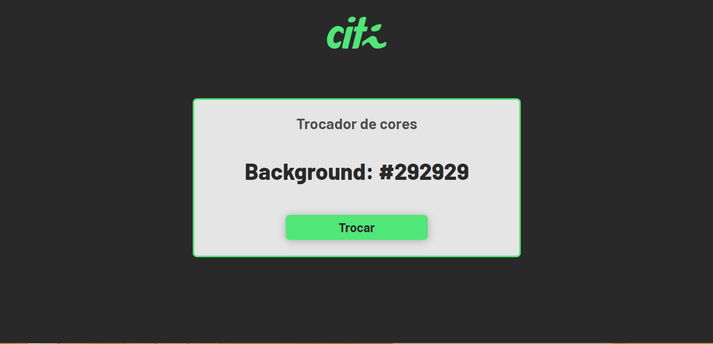
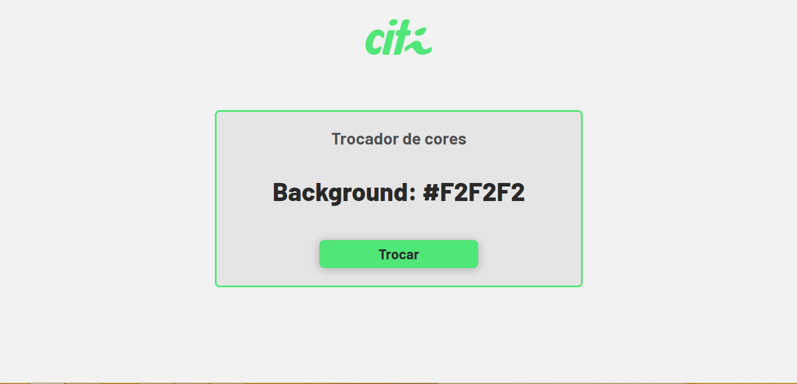
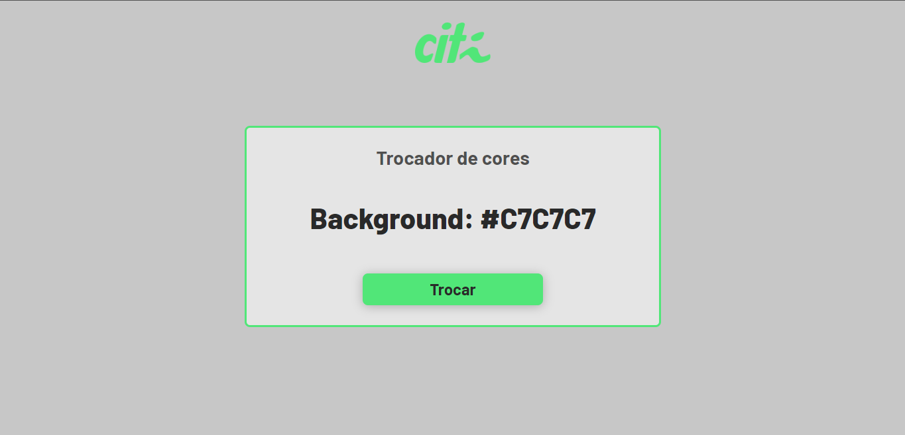

# Desafio 3 do PTA 2022.1 do CITi

Trocador de cores desenvolvido em HTML, CSS e JS para o processo de treinamento por área do CITi :)

Temas de cores disponíves no site:

### Tema preto

### Tema branco

### Tema preto

